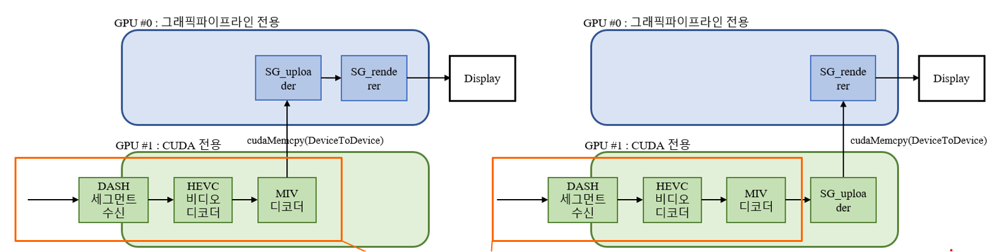

## About Me  
안녕하세요! 저는 **Graphics & Middleware 개발자**로서 저수준 그래픽 API 최적화와 실시간 렌더링에 관심이 많습니다.
특히 **C/C++, Vulkan, CUDA, OpenGL** 등을 사용하여 임베디드 및 모바일 환경에서의 **그래픽 렌더링 및 성능 최적화**를 연구하고 있습니다. 또한 **Immersive Video**와 **View Synthesis**에도 관심을 가지고 있습니다.

## 🔧 Skills

### 🎨 Graphics API
- **Primary:** Vulkan, OpenGL

### ⚡ GPGPU & Compute
- **Primary:** CUDA
- **Experienced:** PyTorch

### 🔍 Debugging & Profiling Tools  
- Nsight Graphics, Radeon Developer Tool Suite, RenderDoc

### 💻 Programming & Development  
- **Languages:** C/C++
- **Tools & Build:** Git, CMake
- **IDE:** Visual Studio (Code)

## 📌 Projects  

### **Vulkan 기반 모바일 광선 추적 어플리케이션 개발**  
기간: 2024.04 ~ 2025.03  
기술 스택: C/C++, Vulkan, Android  
설명:
- 모바일 GPU에서 광선 추적(ray tracing) 최적화
- Nsight Graphics 및 Radeon Developer Tool을 활용한 병목 분석 및 성능 개선
- 그래픽스 드라이버 개선을 위한 실험 데이터 수집

참여인원 : 8명  
역할: 
- Radeon Develooper Tool Suite(RDTS)를 이용한 프로파일링 및 분석
- 비효율적인 Acceleration Structure(AS) 개선을 통한 성능 향상
- 셰이더 최적화

성과 및 결과
- RDTS를 이용한 프로파일링 및 분석
    - Multiple Buffering 미사용으로 인한 GPU 사용율 문제 발견
    - wavefront occupancy를 저하시키는 요인 발견
    - AS 빌드의 비효율성 발견
- 비효율적인 AS 개선을 통한 성능 향상
    - 공간 분할 기법을 통해 AS의 겹치는 부분을 제거하여 약 5% 성능 향상
- 셰이더 최적화
    - 레이트레이싱 파이프라인 셰이더를 최적화하여 약 3% 성능 향상

### **MIV 실시간 렌더러 개발**  
기간: 2024.04 ~ 2024.11  
기술 스택: C/C++, OpenGL, CUDA
설명:
- MPEG Immersive Video 표준에 따르는 실시간 렌더러 개발
- CUDA를 이용해 아틀라스 데이터를 렌더링에 적절한 형태의 데이터로 가공

참여인원 : 7명  
역할: 
- Multi GPU 환경에서 GPU 별 Task 분리 및 GPU 간 효율적인 데이터 통신 방법 연구
- GPU 사용률 조절 기능 구현

성과 및 결과
- 데이터 통신으로 인한 지연을 최소화 하고 GPU 별 Task를 분리한 렌더러 개발
- 렌더링 프레임 제한을 통한 GPU 사용률 조절 기능 구현

### **depth filtering**
기간: 2024.09 ~ 2024.11  
기술 스택: C/C++, Vulkan, CUDA
설명:
- 실사 RGB 이미지에서 깊이 추정을 할 경우 생기는 오차 완화
- 여러 카메라에서 획득한 같은 프레임의 이미지들의 깊이 값을 이용
- 광선 추적 기법을 통해 깊이 오차 완화

참여인원 : 6명
역할: 
- 프로젝트 총괄
- 광선 추적을 통한 깊이 오차 완화 알고리즘 구현

성과 및 결과
- 렌더링 시 아티팩트가 감소되는 깊이 이미지 획득
 

## 📞 Contact  
📧 Email: goliath917@gmail.com  
📂 Portfolio: [GitHub](https://github.com/junsoo-kim)
